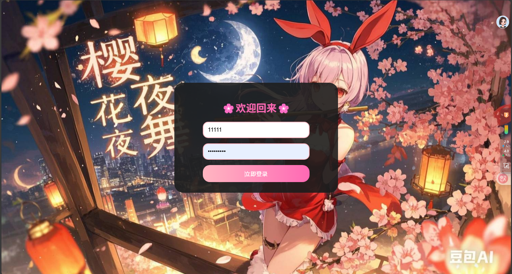
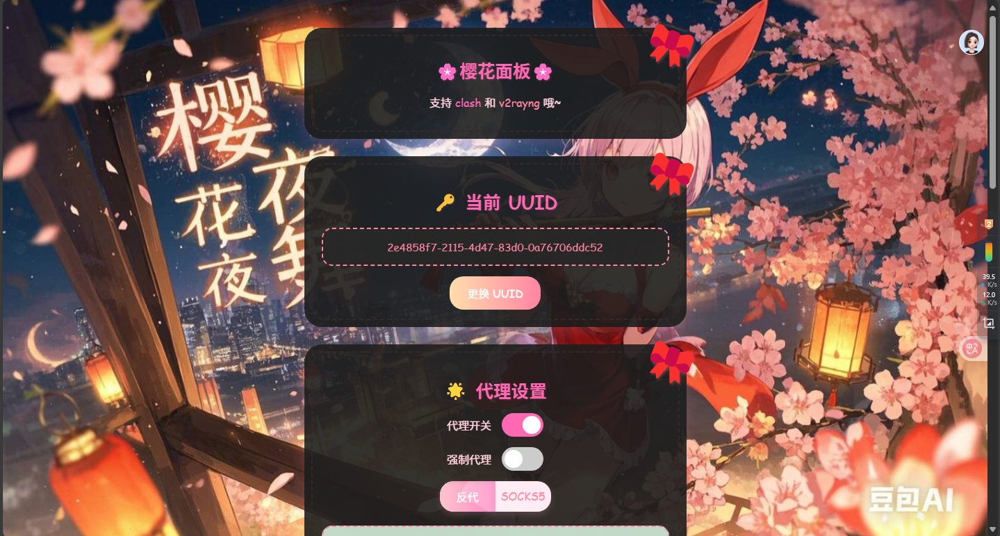
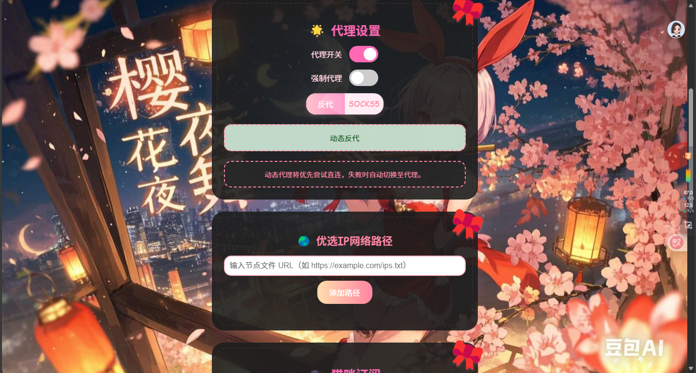
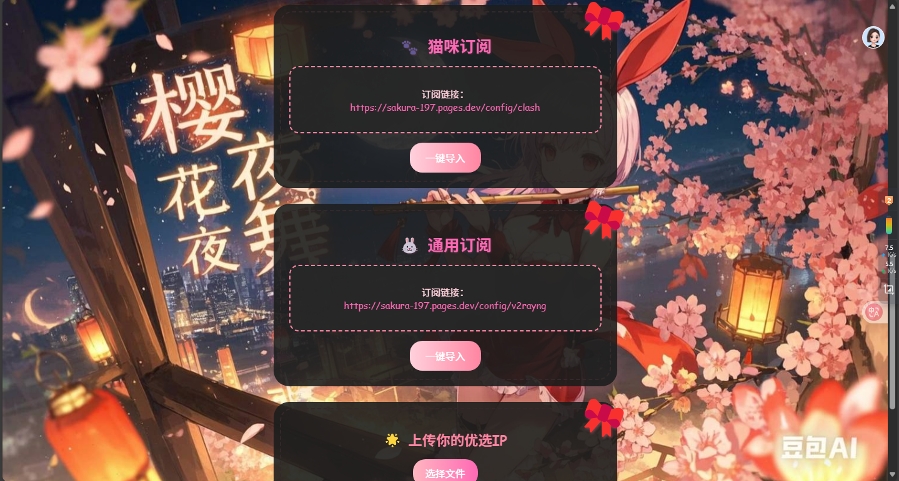
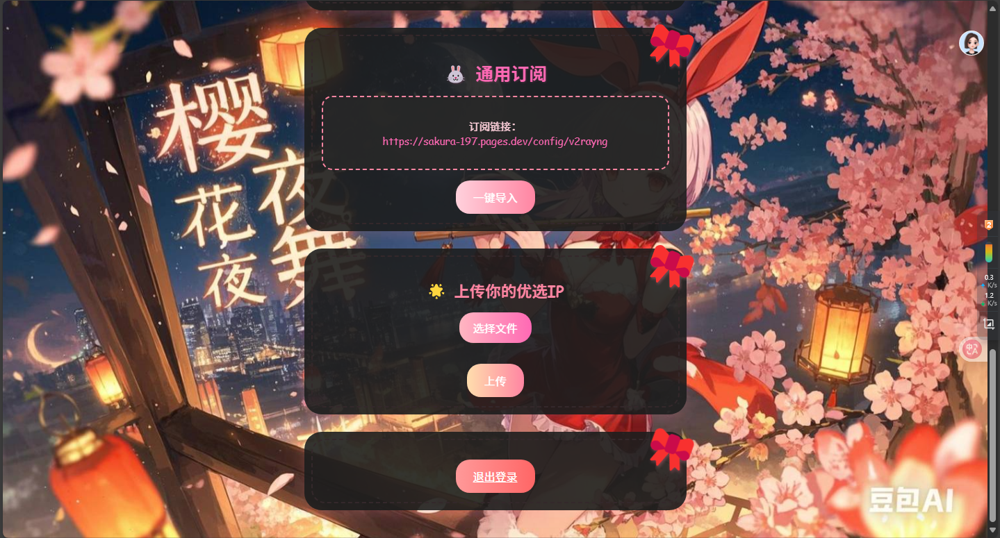

# 🌸 SakuraPanel 🌸

## Project Introduction

SakuraPanel is a proxy management panel built on Cloudflare Workers, providing a clean and visually appealing user interface. It supports the VLESS protocol and flexible node management. The panel features a Chinese interface, is simple and intuitive to operate, and is suitable for users of all levels.

<br>

## ☁️ One-Click Deployment to Cloudflare

[](https://deploy.workers.cloudflare.com/?url=https://github.com/Alien-Et/SakuraPanel)

<br>

> This project uses a modular architecture and no longer supports single-file copy deployment.

### Security Features

SakuraPanel includes the following security features to enhance service stability and availability:

- **Camouflage Webpage**: The root path displays a camouflage webpage to prevent identification as a proxy service by domestic firewalls and Cloudflare's JavaScript detection.
- **Stealth Access**: Actual functionalities are only accessible through specific methods (e.g., specific parameters or paths) to avoid easy discovery.
- **Smart Routing**: Intelligently routes requests based on user status and access methods, ensuring only authorized users can utilize the service.
- **Anti-Blocking Design**: Employs multiple technical measures to reduce the risk of detection and blocking.

## Screenshots

The following are screenshots of the main interfaces of SakuraPanel, showcasing its core features and design:

### 1. Login Interface


### 2. Main Panel Interface


### 3. Node Management Interface


### 4. Subscription Configuration Interface


### 5. Proxy Settings Interface


## Main Features

- **User Authentication System**: Supports registration and login with an account lockout mechanism.
- **Node Management**: Supports manual node upload (append + deduplication), add/remove node paths. Nodes are fetched in real-time on each subscription request and deduplicated intelligently by "address:port".
- **Proxy Configuration**: Supports the VLESS protocol and can generate configurations for Clash, universal clients, and SingBox.
- **Proxy Modes**: Supports direct connection, reverse proxy, SOCKS5, and other connection methods.
- **UUID Management**: Supports UUID regeneration for easier subscription management.
- **Base64 Encryption**: Applies Base64 encryption only to universal subscriptions; Clash and SingBox remain in native formats.
- **Subscription Token Verification**: Generates subscription tokens based on SHA-256 to prevent subscription links from being abused.
- **CF Request Statistics**: Automatically queries today's Workers/Pages request count via Cloudflare GraphQL API and maps it to the `Subscription-Userinfo` response header, allowing clients to display request usage.
- **ECH Encryption**: Supports ECH (Encrypted Client Hello) to improve connection stability.
- **Falling Petal Animation**: Full-interface cherry blossom falling animation with horizontal swaying support.
- **Responsive Design**: Adapts to various device screens with light/dark theme switching support.
- **Hidden Scrollbar**: The preferred IP list area remains scrollable without a visual scrollbar for a cleaner interface.

#### Wallpaper Synchronization System

- Supports custom global wallpapers synchronized across all interfaces.
  - 🌅 Supports setting different wallpapers for light/dark modes.
  - 🔄 Automatic theme switching with real-time background updates.
  - 💾 D1 database storage for persistent settings.
  - 🛡️ Authentication protection to prevent unauthorized modifications.
  - 📱 Full-interface synchronization across login, configuration, and subscription pages.

#### Technical Highlights

- **Frontend Tech**: HTML5, CSS3, JavaScript (ES6+)
- **Backend Tech**: Cloudflare Workers/Pages Functions
- **Database**: Cloudflare D1 Database
- **Encryption Tech**: SHA-256 Hash, Base64 Encoding
- **Network Protocols**: VLESS, HTTP/HTTPS, WebSocket
- **Proxy Protocols**: SOCKS5, HTTP Proxy
- **Security Features**: Password encryption, account lockout, access control
- **Wallpaper System**: D1 persistent storage, automatic theme switching, full-interface sync
- **Subscription Support**: Clash, v2rayn/v2rayng, and SingBox client configurations

## System Requirements

- Cloudflare Workers account
- Cloudflare D1 Database (for data persistence)
- Modern browser with WebSocket support

## Installation and Deployment

### 1. Preparation

1. Register and log in to your [Cloudflare account](https://dash.cloudflare.com/profile/api-tokens)
2. This project uses a D1 database for data storage. During deployment, `wrangler` will automatically create and bind the database; manual creation is not required.

### 2. Deploy Code

#### Method 1: One-Click Deployment (Recommended)

Click the **Deploy to Cloudflare** button at the top of the README. After authorization, it will automatically link this repository and deploy.

#### Method 2: Deploy via Wrangler CLI

```bash
# Clone the repository
git clone https://github.com/Alien-Et/SakuraPanel.git
cd SakuraPanel

# Install dependencies
npm install

# Deploy to Cloudflare Workers
npx wrangler deploy
```

> This project uses a modular architecture (ES Modules) and does not support single-file copy-paste deployment.

#### Method 3: Deploy via Pages

1. Visit the [Cloudflare Pages Console](https://dash.cloudflare.com/pages)
2. Click "Create Project" → "Connect to Git"
3. Select this repository (your forked version)
4. Build settings:
   - **Build command**: Leave empty
   - **Build output directory**: Leave empty
5. Click "Save and Deploy"

> Pages deployment also uses a modular architecture and does not support single-file copy-paste.

#### D1 Database Notes

This project uses a D1 database for data storage. During deployment, `wrangler` will automatically create and bind the database; manual creation is not required.

#### Environment Variable Configuration

1. In the [Cloudflare Pages Console](https://dash.cloudflare.com/pages), select your project.
2. Click "Settings" → "Environment Variables"
3. Add the following environment variables (optional):
   - `PASSWORD_HASH_SALT`: Password encryption salt (default: `default_salt`)
   - `MAX_LOGIN_ATTEMPTS`: Maximum login attempts (default: `5`)
   - `LOCKOUT_DURATION`: Account lockout duration in minutes (default: `30`)
4. Click "Save"

### 3. Custom Domain Setup

#### Workers Custom Domain Setup

1. Visit the [Cloudflare Workers Console](https://dash.cloudflare.com/workers)
2. Select your Worker service
3. Click the "Triggers" tab
4. In the "Custom Domains" section, click "Add Custom Domain"
5. Enter your custom domain (e.g., `panel.yourdomain.com`)
6. Click "Add Custom Domain"
7. Follow the prompts to add a CNAME record in your DNS provider pointing to your Worker domain (e.g., `your-worker.your-subdomain.workers.dev`)
8. Wait for DNS propagation and SSL certificate issuance (usually takes a few minutes to hours)

#### Pages Custom Domain Setup

1. Visit the [Cloudflare Pages Console](https://dash.cloudflare.com/pages)
2. Select your Pages project
3. Click the "Custom Domains" tab
4. Click "Set up Custom Domain"
5. Enter your custom domain (e.g., `panel.yourdomain.com`)
6. Click "Continue"
7. Follow the prompts to add a CNAME record in your DNS provider pointing to your Pages project domain (e.g., `your-project.pages.dev`)
8. Wait for DNS propagation and SSL certificate issuance (usually takes a few minutes to hours)

**Note**: The custom domain must already be added to your Cloudflare account and use Cloudflare's DNS service. If using another DNS provider, ensure the CNAME record is correctly configured.

### 4. Optional Environment Variable Setup

#### Workers Environment Variables

1. Visit the [Cloudflare Workers Console](https://dash.cloudflare.com/workers)
2. Select your Worker service
3. Click "Settings" → "Variables" → "Environment Variables"
4. Click "Add Variable"
5. Add the following environment variables (optional):
   - `PASSWORD_HASH_SALT`: Password encryption salt (default: `default_salt`)
   - `MAX_LOGIN_ATTEMPTS`: Maximum login attempts (default: `5`)
   - `LOCKOUT_DURATION`: Account lockout duration in minutes (default: `30`)
   - `PROXYIP`: Reverse proxy fallback address (default: `ProxyIP.JP.CMLiussss.net`, only effective if D1 is not configured)
   - `SOCKS5`: SOCKS5 account fallback (format: `username:password@host:port`, only effective if D1 is not configured)
6. Click "Save"

#### Pages Environment Variables

1. In the [Cloudflare Pages Console](https://dash.cloudflare.com/pages), select your project
2. Click "Settings" → "Environment Variables"
3. Click "Add Variable"
4. Add the following environment variables (optional):
   - `PASSWORD_HASH_SALT`: Password encryption salt (default: `default_salt`)
   - `MAX_LOGIN_ATTEMPTS`: Maximum login attempts (default: `5`)
   - `LOCKOUT_DURATION`: Account lockout duration in minutes (default: `30`)
   - `PROXYIP`: Reverse proxy fallback address (default: `ProxyIP.JP.CMLiussss.net`, only effective if D1 is not configured)
   - `SOCKS5`: SOCKS5 account fallback (format: `username:password@host:port`, only effective if D1 is not configured)
6. Click "Save"

## URL Path Description

### Basic URL Structure

After deploying SakuraPanel, it can be accessed via the following URLs:

- **Workers Deployment**: `https://<worker-name>.<subdomain>.workers.dev`
- **Pages Deployment**: `https://<project-name>.pages.dev`
- **Custom Domain**: `https://<your-custom-domain>`

### Main Path Functions

SakuraPanel provides multiple functional paths, each corresponding to different features:

#### 1. Root Path `/`

- **Function**: Camouflage webpage to prevent detection and blocking.
- **Behavior**:
  - Displays normal webpage content, mimicking a regular website.
  - Prevents identification as a proxy service by domestic firewalls and Cloudflare's JavaScript detection.
  - Unauthenticated users: Can only access the login page through specific methods (e.g., specific parameters or paths).
  - Authenticated users: Can only enter the main panel through specific methods.
- **Example**: `https://sakura-panel.workers.dev/`
- **Security Features**:
  - Disguises as a regular website to lower detection risk.
  - Avoids identification by Cloudflare's JavaScript analysis.
  - Improves service stability and availability.

#### 2. Login Path `/login`

- **Function**: User login interface.
- **Behavior**:
  - Displays a login form with username and password fields.
  - Supports remembering login state (via cookies).
  - Failed logins display error messages and remaining attempts.
- **Example**: `https://sakura-panel.workers.dev/login`

#### 3. Register Path `/register`

- **Function**: User registration interface.
- **Behavior**:
  - Displays a registration form with username and password fields.
  - Username requirement: 4-20 alphanumeric characters.
  - Password requirement: At least 6 characters.
  - Upon successful registration, automatically logs in and redirects to the main panel.
- **Example**: `https://sakura-panel.workers.dev/register`

#### 4. Panel Path `/panel`

- **Function**: Main subscription panel interface.
- **Behavior**:
  - Displays the user subscription panel, including UUID, proxy settings, encryption settings, ECH settings, proxy service settings, wallpaper settings, preferred IP network paths, upload preferred nodes, subscription links, etc.
  - Requires login status to access.
- **Example**: `https://sakura-panel.workers.dev/panel`

#### 5. Subscription Paths `/panel/clash`, `/panel/v2rayn`, `/panel/singbox`

- **Function**: Retrieve subscription link content.
- **Behavior**:
  - Returns configuration content corresponding to the subscription link.
  - Supports Clash, universal, and SingBox subscription formats.
  - Includes user UUID and current node list.
- **Examples**:
  - `https://sakura-panel.workers.dev/panel/clash`
  - `https://sakura-panel.workers.dev/panel/v2rayn`
  - `https://sakura-panel.workers.dev/panel/singbox`

#### 6. WebSocket Path `/?ed=2560`

- **Function**: WebSocket connection path for VLESS protocol transmission.
- **Behavior**:
  - Handles WebSocket upgrade requests.
  - Supports VLESS over WebSocket transmission.
  - Automatically handles Early Data and connection proxy logic.
- **Example**: `wss://sakura-panel.workers.dev/?ed=2560`
- **Client Configuration**:
  ```yaml
  # Xray/Clash Configuration Example
  - name: "SakuraPanel"
    type: vless
    server: your-domain.com
    port: 443
    uuid: your-uuid-here
    network: ws
    ws-opts:
      path: "/?ed=2560"
      headers:
        Host: your-domain.com
    tls: true
    skip-cert-verify: false
  ```

### Path Access Permissions

Different paths have different access permission requirements:

- **Public Access**: `/login`, `/register`
- **Requires Login**: `/`, `/panel`, `/panel/clash`, `/panel/v2rayn`, `/panel/singbox`
- **Admin Access**: None (no independent admin path in the current version)

### Path Redirection

SakuraPanel automatically redirects paths based on user status:

- The root path (`/`) displays a camouflage webpage; users must access actual features through specific methods.
- Unauthenticated users accessing login-required paths are automatically redirected to `/login`.
- Authenticated users accessing `/login` or `/register` are automatically redirected to the main panel.

**Secure Access Methods**:

To securely access SakuraPanel, users can use the following methods:

1. **Directly access the login path**: `https://<your-domain>/login`
2. **Directly access the registration path**: `https://<your-domain>/register`
3. **Directly access the panel path**: `https://<your-domain>/panel` (requires login first)

> Note: The root path `/` will camouflage as a regular website and will not directly display the panel. Please use the paths above to access directly.

These secure access methods effectively avoid detection and blocking while ensuring only users who know the correct access methods can use SakuraPanel.

## Usage Guide

### First-Time Use

1. Directly visit `https://<your-domain>/register` to register an account.
2. Set a username (4-20 alphanumeric characters) and password (at least 6 characters).
3. After registration, the system will automatically redirect to the main panel `/panel`.

### Login and Security

- Visit `https://<your-domain>/login` to log in.
- After reaching the maximum failed login attempts (default: 5), **this device** will be locked for 5 minutes.
- Device identification uses coarse-grained fingerprints (browser major version + OS + IP, e.g., `edge135_android_1.2.3.4`), preventing mutual lockouts for multiple users behind the same NAT IP and avoiding key expansion from minor UA variations.
- Failed count and lockout keys expire automatically after 30 minutes, preventing invalid data accumulation in D1.
- Supports maintaining login state via cookies (valid for 5 minutes).

### Node Management

#### Upload Node Files

1. In the main panel, locate the "Upload Your Preferred Nodes" section.
2. Click "Choose File" and select a text file containing the node list (one node per line).
3. The system will **automatically upload** and process the file; no additional upload button click is required.
4. Uploaded nodes will be **appended** to the existing manual node list (without overwriting existing nodes).
5. The system automatically deduplicates by "address:port"; the same node is kept only once. Re-uploading a node with the same IP:port will update its name.

#### Manage Uploaded Nodes

1. View all current manual nodes in the "Uploaded Nodes" section.
2. Click "Remove" on the right side of a single node to delete it.
3. Click "Delete All" to clear all manual nodes (requires confirmation).

#### Add Node Paths

1. In the "Preferred Node Network Path" section, enter the URL of the node file (e.g., `https://example.com/nodes.txt`).
2. Click the "Add Path" button.
3. The system will pre-fetch the URL for validation and provide feedback on the fetch status (success/failure) and node count.
4. On each subscription request, the system **fetches in real-time** from all paths, merges, and deduplicates nodes. No cache is used; adding/removing paths takes effect immediately.

#### Remove Node Paths

1. In the node path list, locate the path you want to remove.
2. Click the corresponding "Remove" button.

### Wallpaper Settings

#### Custom Wallpapers

1. In the "Wallpaper Settings" section, you can set background images for light and dark modes.
2. Enter the wallpaper image URL (supports HTTPS).
3. You can set different wallpapers for light mode and dark mode.
4. Leave empty to use the default cherry blossom theme wallpaper.

#### Wallpaper Synchronization

1. Set wallpapers are automatically synchronized across all interfaces (login, register, config, subscription, etc.).
2. The system automatically switches the corresponding wallpaper based on user theme preferences.
3. Wallpaper settings are saved in the D1 database and remain effective after restart.

#### Restore Default Wallpaper

1. Click the "Restore Default" button to reset to the system default wallpaper.
2. You will need to reconfigure custom wallpapers after restoring.

### Proxy Settings

#### Proxy Toggle

1. In the "Proxy Settings" section, use the toggle to enable or disable proxy functionality.
2. When disabled, the system will use direct connection mode.

#### Proxy Type Selection

1. After enabling the proxy, you can choose between "Reverse Proxy" or "SOCKS5" modes.
2. Reverse Proxy Mode: Uses Cloudflare's reverse proxy functionality.
3. SOCKS5 Mode: Uses the configured SOCKS5 proxy server.

#### Force Proxy

1. Enabling "Force Proxy" routes all connections through the proxy server.
2. When disabled, the system prioritizes direct connection and automatically switches to proxy upon failure.

### Encryption Settings

#### Base64 Encryption Configuration

1. In the "Encryption Settings" section, you can enable or disable Base64 encryption.
2. When enabled, only universal subscriptions (V2Ray/V2RayNG/V2RayN) are Base64 encrypted.
3. Clash and SingBox subscriptions always remain in native YAML/JSON format and are not encrypted.
4. Changes take effect immediately upon toggling; no additional action is required.

### Subscription Token Verification

1. In the "Subscription Token Verification" section, toggle the switch to enable token verification.
2. Tokens are automatically generated based on the current domain and UUID (SHA-256); manual entry is not required.
3. When enabled, subscription links automatically append the `?token=xxx` parameter.
4. Changing the UUID automatically updates the token; old links immediately become invalid.
5. Subscription requests without the correct token will be rejected.

### CF Request Statistics

1. In the "CF Request Statistics" section, select an authentication method (choose one):
   - **API Token**: Enter Account ID and API Token (requires Account Analytics: Read permission).
   - **Email + Global API Key**: Enter Cloudflare login email and Global API Key.
2. Click "Refresh Usage" to view today's Pages and Workers request counts.
3. When enabled, the `Subscription-Userinfo` response header is automatically injected, allowing clients to display request usage.
4. Query results are cached for 5 minutes to avoid frequent API calls.
5. Credentials are masked after saving; click the input field to view/edit the real values.

### Subscription Configuration

#### Retrieve Subscription Links

1. In the main panel, locate the "Clash Subscription", "Universal Subscription", or "SingBox Subscription" sections.
2. Copy the displayed subscription link.
3. Import the link into a supported client.

#### Change UUID

1. In the "Current UUID" section, click the "Change UUID" button.
2. The system will generate a new UUID.
3. After changing, you must retrieve the subscription link again.

#### Log Out

1. At the bottom of the main panel, click the "Log Out" button.
2. The system will clear the login state and return to the login page.

## Configuration Details

### Node Format

#### File Upload Restrictions

The system has the following restrictions for uploaded node files:

- **File Format**: Only `.txt` text files are supported.
- **File Size**: Maximum 1MB.
- **Content Requirements**: One node per line, complying with the format requirements below.

#### Node Format Specification

The system supports multiple node formats, one per line, with flexible options:

1. **Complete Format**: `[address]:port#node_name@tls/notls`
   - Example: `1.2.3.4:443#US-01@tls`
   - Example: `[2001:db8::1]:80#JP-01@notls`

2. **Without Port Format**: `[address]#node_name@tls/notls`
   - Example: `1.2.3.4#US-01@tls`
   - The system will use the default port (`tls` = 443, `notls` = 80).

3. **Without Protocol Format**: `[address]:port#node_name`
   - Example: `1.2.3.4:443#US-01`
   - The system will use the default protocol `tls`.

4. **Minimal Format**: `[address]`
   - Example: `1.2.3.4`
   - The system will use the default port (`tls` = 443, `notls` = 80), default protocol `tls`, and default node name "🌸Sakura".

#### Format Explanation

- **Address**: Supports IPv4 addresses (e.g., `1.2.3.4`), IPv6 addresses (e.g., `[2001:db8::1]`), and domains (e.g., `example.com` or `sub.example.com`).
- **Port**: Range 1-65535. Uses default values if unspecified (`tls` = 443, `notls` = 80).
- **Node Name**: Custom node name. Uses default "🌸Sakura" if unspecified.
- **Protocol**: Supports `tls` (encrypted) and `notls` (unencrypted). Uses default `tls` if unspecified.

#### Example File Content

```
# Complete format examples
1.2.3.4:443#US-01@tls
[2001:db8::1]:443#JP-01@notls
example.com:443#ExampleDomain-01@tls
sub.example.com:8080#SubDomain-01@notls

# Without port examples
5.6.7.8#HK-01@tls
[2001:db8::2]#SG-01@notls
another-example.com#DomainExample-01@tls

# Without protocol examples
9.10.11.12:8080#TW-01
[2001:db8::3]:2053#KR-01
test-domain.com:443#TestDomain-01

# Minimal format examples (default tls, port 443)
13.14.15.16
[2001:db8::4]
simple-domain.com

# Minimal format examples (notls, port 80)
1.2.3.4#US-01@notls
example.com#ExampleDomain-01@notls
```

#### Validation Rules

The system validates uploaded node files as follows:

1. **File Format Validation**: Ensures the file is `.txt` format.
2. **File Size Validation**: Ensures the file does not exceed 1MB.
3. **Node Format Validation**: Ensures each line complies with the format requirements above.
4. **Address Validity Validation**: Ensures IPv4 address format is correct and domain format complies with standards.
5. **Port Range Validation**: If a port is specified, ensures it is within the 1-65535 range.

Nodes not meeting format requirements will be ignored. Only compliant nodes will be added to the node list.

#### Node Deduplication Rules

The system uniformly deduplicates nodes from different sources (URL path fetches, manual uploads) by **`address:port`** to prevent duplicates caused by format variations:

- **Unified Parsing**: The new `parseNode()` function supports all formats (`[IPv6]:port#name@tls`, `IPv4:port#name@tls`, `domain#name`, pure address, etc.), extracting `lowercase_address:port` as the deduplication key (IPv6 brackets removed, domains/IPs lowercased, default ports: `tls`=443, `notls`=80).
- **Priority**: Manual uploaded nodes take precedence over URL fetched nodes (manual nodes are standardized and carry custom names, overriding URL nodes with the same IP:port).
- **Upload Merging**: When manually uploading, new nodes are appended to the existing list and merged by the deduplication key. Re-uploading a node with the same IP:port will overwrite the old entry to update its name.
- **Example**: `1.2.3.4` from a URL and manually uploaded `1.2.3.4:443#JP@tls` will be recognized as the same node, and the manually uploaded entry will be retained.

### Environment Variables

#### PROXYIP

Sets the reverse proxy address. Format: `host:port`, e.g.:
```
ProxyIP.JP.CMLiussss.net:443
```

#### SOCKS5

Sets the SOCKS5 proxy account. Format: `username:password@host:port`, e.g.:
```
username:password@socks.example.com:1080
```

## Technical Details

### Camouflage Webpage Technology

SakuraPanel uses camouflage webpage technology to prevent detection and blocking:

- **Normal Webpage Content**: The root path returns content that looks like a regular website, including HTML, CSS, and JavaScript.
- **Anti-Detection Design**:
  - Avoids common proxy-related keywords.
  - Uses normal webpage structures and resource references.
  - Simulates real website interactive behaviors.
- **Stealth Entry Points**:
  - Access login page via specific subpaths (e.g., `/login`).
  - Access main panel via specific subpaths (e.g., `/panel`).
  - These entry points are not directly displayed on the camouflage webpage.

### Protocol Support

- **VLESS**: Supports VLESS protocol with WebSocket transmission.
- **TLS**: Supports TLS encryption, specifiable via `@tls` or `@notls`.
- **WebSocket Path**: Defaults to `/?ed=2560` as the WebSocket path, supporting Early Data.

### Connection Modes

SakuraPanel supports multiple proxy connection modes. Users can choose the appropriate mode based on their network environment and needs:

#### 1. Direct Connection Mode
- **How it Works**: Client → Cloudflare Workers → Target Website
- **Location Display**: Client's real IP location
- **Use Case**: Good network environment, no proxy needed

#### 2. Force Proxy Mode
- **How it Works**: Client → Cloudflare Workers → Force Proxy Server → Target Website
- **Location Display**: Force proxy server location
- **Features**: All traffic is forced through the proxy server, fixed exit IP.
- **Sub-modes**:
  - **Reverse Proxy Mode**: Uses TCP passthrough, directly forwards to the reverse proxy server.
  - **SOCKS5 Mode**: Uses SOCKS5 protocol to connect to the proxy server.

#### 3. Dynamic Proxy Mode (Smart Mode)
- **How it Works**:
  ```
  Client → Cloudflare Workers → Target Website
             ↓ Direct Connection Fails
         Force Proxy Server → Target Website
  ```
- **Location Display**:
  - Direct connection success: Client's real IP location
  - Direct connection fails & switches to proxy: Force proxy server location
- **Features**: Intelligent switching, prioritizes direct connection, automatically switches to proxy on failure.

### Proxy Settings Explanation

#### Force Proxy vs Dynamic Proxy

| Mode | Connection Strategy | Location Display | Applicable Scenario |
|-----|---------|------------|----------|
| **Force Proxy** | Always uses proxy | Proxy server IP | Requires fixed exit IP |
| **Dynamic Proxy** | Intelligent switching | Direct/Proxy IP | Balances speed and stability |

#### Reverse Proxy Mode vs SOCKS5 Mode

| Mode | Protocol Type | Connection Method | Performance Features |
|-----|---------|----------|----------|
| **Reverse Proxy Mode** | TCP Passthrough | Direct forward | Faster, lower latency |
| **SOCKS5 Mode** | SOCKS5 Protocol | Handshake & Auth | More secure, supports authentication |

### Smart Connection Logic

The system attempts connections based on the following priority:
1. If proxy is disabled, uses direct connection.
2. If force proxy is enabled, directly connects using the configured proxy type.
3. If proxy is enabled but not forced, attempts direct connection first, then switches to proxy on failure.

#### Error Handling Flow

When a connection fails, the system will:
1. **Force Proxy Mode**: Reports error directly, does not attempt other methods.
2. **Dynamic Proxy Mode**:
   - Direct connection fails → Automatically switches to proxy.
   - Proxy fails → Reports error and logs it.

#### Console Logs

The system outputs detailed connection logs to the console:
- `[Smart Connection] Force Reverse Proxy: candidate=...` - Force reverse proxy mode
- `[Smart Connection] Force SOCKS5: ...` - Force SOCKS5 mode
- `[Smart Connection] Direct connection failed, dynamically switching to proxy: ...` - Dynamic mode switch
- `[Smart Connection] Dynamic Reverse Proxy: candidate=...` - Dynamic reverse proxy switch
- `[Smart Connection] Dynamic SOCKS5: ...` - Dynamic SOCKS5 switch
- `[Direct Connection] Start/Success/Failure: ...` - Direct connection mode

### Error Handling

- The system logs connection failure events.
- If a single node path fetch fails, it skips that path without affecting node loading from other paths.
- If all node sources (URL paths + manual uploads) fail, it falls back to the deployment domain `hostName:443`.
- Subscription configurations are generated in real-time on each request with no cache layer, ensuring synchronization with the latest node list.

## Frequently Asked Questions

### Q: How to bind the D1 database?

A: This project uses a D1 database for data storage. During deployment, `wrangler` will automatically create and bind the database; manual binding is not required. If deploying via Pages, you need to add a D1 database binding in the Pages console under "Functions" settings, with the binding name `D1DB`.

### Q: Why can't I log in?

A: Please check the following:
1. Ensure the D1 database is correctly bound.
2. Verify your username and password are correct.
3. If multiple login attempts failed, the account may be locked. Please wait 5 minutes and retry.

### Q: How to add my own nodes?

A: You can add nodes in two ways:
1. Click "Choose File" in the panel to upload a `.txt` file containing the node list. The system will automatically upload and process it.
2. Add the URL of the node file. The system will fetch the node list from that URL in real-time.
3. Uploaded manual nodes can be viewed, deleted individually, or cleared entirely in the "Uploaded Nodes" section.

### Q: What to do if the subscription link doesn't work?

A: Try the following steps:
1. Confirm the node list is configured correctly.
2. Try changing the UUID.
3. Check if your client supports the VLESS protocol.
4. If Base64 encryption is enabled, ensure your client supports Base64-encoded configuration files.

### Q: After enabling Base64 encryption, which subscriptions are affected?

A: Base64 encryption only applies to **Universal Subscriptions** (V2Ray/V2RayNG/V2RayN). Clash subscriptions always return YAML format, and SingBox subscriptions always return JSON format. They are unaffected by the Base64 encryption toggle to ensure client compatibility.

### Q: How to improve connection speed?

A: You can try the following methods:
1. **Use a Custom Domain** (Most Important): Default `workers.dev` or `pages.dev` domains are easily throttled or blocked by ISPs. Using a custom domain significantly improves connection speed and stability.
2. Add more high-quality nodes.
3. Enable proxy functionality and choose an appropriate proxy type.
4. Use "Force Proxy" mode to ensure all connections route through the proxy server.

### Q: Some China Mobile and China Telecom users in certain areas cannot use nodes normally, receiving timeout prompts?

A: **Important Warning**: Users with China Mobile and China Telecom in certain regions may encounter timeout prompts in the Clash client. Testing shows that China Unicom and China Broadcasting Network users can normally use this node service. Firewall policies vary by ISP and region; some China Mobile/Telecom users may still access it normally.

**⚠️ Strongly Recommended to Use a Custom Domain**:
- Some ISPs block default `*.workers.dev` or `*.pages.dev` domains.
- Using a custom domain significantly reduces blocking risk.
- Even if Clash shows a timeout, using a custom domain still has an ~80% chance of successful connection.
- Custom domain setup instructions are in the [Custom Domain Setup](#custom-domain-setup) section.

If you encounter connection issues, we recommend:
1. **Prioritize using a custom domain**, avoiding default `workers.dev` or `pages.dev` domains.
2. Try switching network environments (e.g., to China Unicom or China Broadcasting Network).
3. Try different proxy modes (Reverse Proxy or SOCKS5).

### Q: What to do when Clash client shows timeout?

A: Ignore the timeout display in the Clash client. If `flclash` shows the landing IP, it means the connection is successful (you can freely connect via IPv4/IPv6 nodes). Nekobox and V2RayNG are exceptions.

**💡 Important Note**: If you are using the default `*.workers.dev` or `*.pages.dev` domain, strongly consider setting up a custom domain:
- Default domains are easily targeted for blocking by ISPs.
- After using a custom domain, even if Clash shows timeout, there's still ~80% chance of successful connection.
- Custom domains are one of the most effective solutions for connection issues.

### Q: After enabling Force Proxy in the panel, why does flclash always show the landing IP and location of the Reverse Proxy/SK5?

A: After enabling Force Proxy in the panel, flclash will display the landing IP and location of the Reverse Proxy/SK5, regardless of which preferred IP location is selected. It will forcefully show the Reverse Proxy/SK5 landing IP and location.

## Changelog

### v1.5.0
- Added network reachability and content format validation before adding node paths:
  - 3-second timeout probe for target URL; blocks immediately if unreachable.
  - Reads returned content and validates for IPv4/IPv6/domain presence; prevents adding invalid addresses.
- Changed preferred node upload to **auto-upload on file selection**, removing the manual upload button to reduce steps.
- Added manual node management interface: Displays uploaded nodes in D1, supports **individual deletion** and **clear all**.
- Optimized display of ultra-long network paths: Text auto-ellipsis to prevent button overflow.
- Added manual node management APIs: `get-manual-nodes`, `remove-manual-node`, `clear-manual-nodes`.

### v1.4.0
- Changed subscription configuration and node list to **completely real-time generation/fetching**, removing all configuration caches (`config_clash`/`config_v2ray`) and version numbers (`config_*_version`/`ip_preferred_ips_version`), unifying with SingBox's existing mode. Changing UUID no longer causes duplicate generation due to version mismatches.
- Removed node list cache (`ip_preferred_ips`) and redundant log keys (`ip_error_log`). Each subscription request fetches URL nodes in real-time and merges manual nodes. D1 only persists `node_file_paths` and `manual_preferred_ips`.
- Changed node deduplication to unified **`address:port`** deduplication. Added `parseNode()` to support multiple formats (IPv6/IPv4/domain, with/without port, with/without name/protocol), resolving duplication issues caused by format differences between URL nodes and manually uploaded standardized nodes.
- Changed manual node upload from overwrite to **append + deduplication**. New nodes are appended to the existing list and merged by deduplication key. Re-uploading a node with the same IP:port updates its name.
- Changed login failure device identification to coarse-grained fingerprint (browser major version + OS + IP). Failed count keys `fail_*` and lockout keys `lock_*` set to auto-expire after 30 minutes, preventing NAT same-IP mislockouts and D1 invalid data accumulation.
- Added pre-fetch validation when adding node paths, providing fetch status and node count feedback.

### v1.3.0
- Added subscription token verification feature:
  - Generates token based on SHA-256(host+UUID); subscription requests require `?token=` parameter.
  - Token auto-updates when UUID changes; old links become invalid.
- Added CF request statistics feature:
  - Queries today's Workers/Pages request count via Cloudflare GraphQL API.
  - Supports API Token and Email+Global API Key authentication (choose one).
  - Maps to `Subscription-Userinfo` response header; clients can display request usage.
  - Query results cached for 5 minutes; credentials masked for display.
- Fixed Base64 encryption logic:
  - Clash and SingBox subscriptions no longer Base64 encrypted; maintain native YAML/JSON format.
  - Only universal subscriptions (V2Ray) retain Base64 encryption.
- Added full-interface falling petal animation effect (shared module, unified management).
- Added project driving attribution to the bottom of all interfaces.
- Code refactoring: Extracted petal effects into a shared module, reducing redundancy.

### v1.2.4
- Added SingBox configuration and subscription support:
  - Added SingBox configuration generation, outputting standard JSON format config files.
  - Added SingBox subscription links, supporting direct import into SingBox clients.
  - Subscription panel title changed to "📦 SB Subscription".
- Optimized preferred IP list display:
  - Removed scrollbar visual style from list area, maintaining scrollability with a cleaner interface.
- Optimized code stealth:
  - Changed SingBox-related plaintext in frontend titles, comments, and error logs to `atob()` format.
- Fixed several UI detail issues.

### v1.2.3
- Optimized configuration file download filename format:
  - Clash config automatically appends `.yaml` suffix for client recognition.
  - Universal config (V2Ray/V2RayNG/V2RayN) automatically appends `.txt` suffix, complying with standard format.
  - Maintains proxy service name as the filename base, supports Chinese display.
  - Uses dual filename format (`filename` and `filename*=utf-8''`) to ensure compatibility.

### v1.2.2
- Added custom configuration filename feature:
  - Added `Content-Disposition` response header for Clash, V2Ray, V2RayNG, V2RayN configs.
  - Supports custom download filenames, using proxy service name as the filename.
  - Uses dual filename format (`filename` and `filename*=utf-8''`) to ensure correct Chinese filename display.
  - Filters special characters to ensure filename safety.
  - Defaults to "❀SakuraSubscription❀" as the proxy service name.
- Optimized `wrangler.toml` configuration:
  - Added detailed Chinese comments.
  - Clarified the purpose and usage of each configuration item.
  - Provided complete environment variable configuration guide.

### v1.2.1
- Fixed proxy address configuration issues:
  - Updated default reverse proxy address to `ProxyIP.JP.CMLiussss.net`.
  - Improved proxy mode documentation.
  - Optimized proxy connection logic and error handling.

### v1.2.0
- Added Base64 encryption feature:
  - Added Base64 encryption toggle, supporting encryption of subscription links.
  - Toggling immediately encrypts/decrypts Clash and universal configs and saves to D1 database.
  - Improves subscription link security, preventing easy identification and interception.
- Optimized config generation logic, supporting both encrypted and unencrypted modes.
- Improved UI, added encryption settings card.

### v1.1.0
- Enhanced node file upload functionality:
  - Added file format validation, only supporting `.txt` files.
  - Added file size limit, max 1MB.
  - Supports multiple flexible node formats:
    - Complete format: `[address]:port#node_name@tls/notls`
    - Without port format: `[address]#node_name@tls/notls`
    - Without protocol format: `[address]:port#node_name`
    - Minimal format: `[address]`
  - Added node format validation and address validity checks.
  - Uses default port 443 if unspecified.
  - Uses default protocol `tls` if unspecified.
  - Uses default node name "🌸Sakura" if unspecified.
- Optimized UI, added file format requirement instructions.
- Improved error prompts and user experience.

### v1.0.0
- Initial release.
- Supports user registration and login.
- Supports node management and subscription generation.
- Supports multiple proxy modes and smart connections.

## Contributing

Feel free to submit Issues and Pull Requests to improve this project.

## License

This project is licensed under the MIT License. See the LICENSE file for details.

## Contact

For questions or suggestions, please contact via:
- Submit Issue: [GitHub Issues](https://github.com/Alien-Et/SakuraPanel/issues)

---

**Note**: This project is for learning and research purposes only. Please comply with local laws and regulations, and do not use it for illegal purposes.
