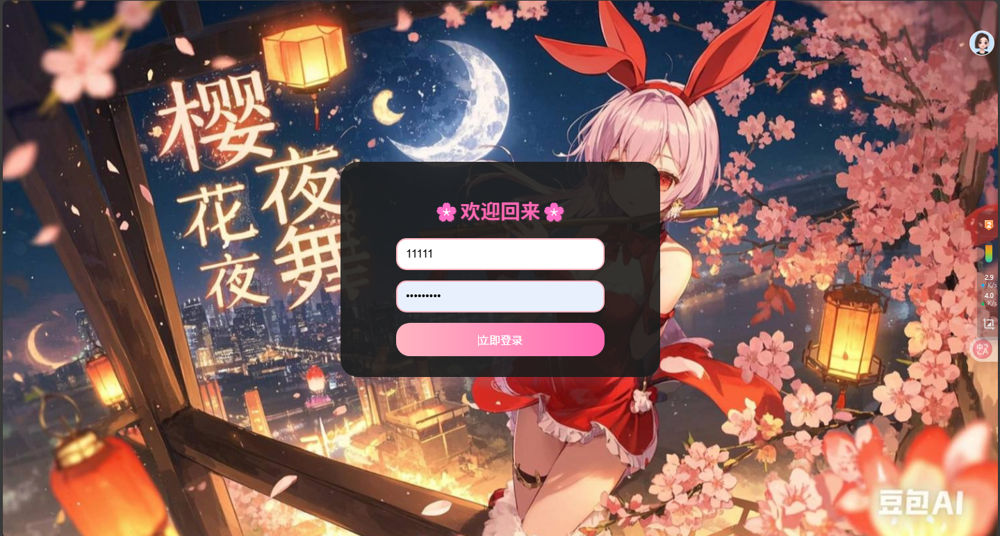
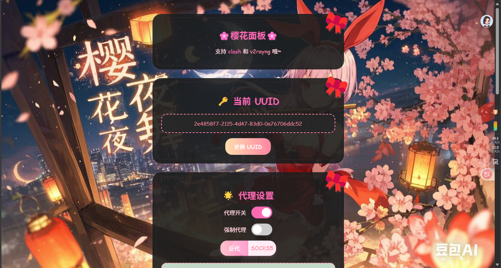
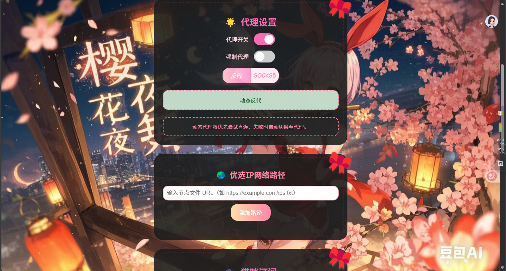
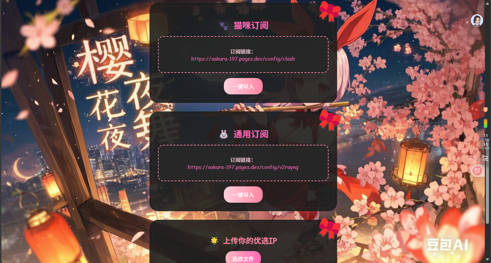
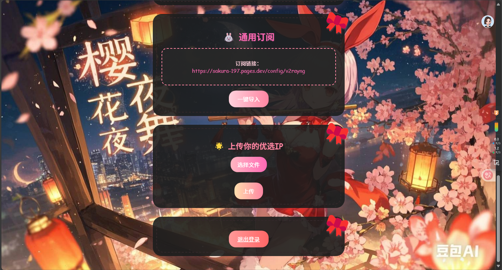

# 🌸 樱花面板 (SakuraPanel) 🌸

## 🎯 项目简介

樱花面板是一个基于Cloudflare Workers的代理管理面板，提供简洁美观的用户界面，支持多种代理协议和灵活的节点管理。该面板使用中文界面，操作简单直观，适合各类用户使用。

### 🛡️ 安全特性

樱花面板具有以下安全特性，以提高服务的稳定性和可用性：

- **🔍 伪装网页**：根路径显示伪装网页，防止被国内防火墙和Cloudflare的JavaScript检测识别为代理服务
- **🔒 隐蔽访问**：通过特定方式（如特定参数或路径）才能访问实际功能，避免被轻易发现
- **🧠 智能路由**：根据用户状态和访问方式智能路由，确保只有授权用户才能使用服务
- **🛡️ 防封锁设计**：采用多种技术手段降低被检测和封锁的风险
- **📄 安全文件名**：配置文件下载使用纯机场名称，避免敏感词触发封锁

## 界面截图

以下是樱花面板的主要界面截图，展示了面板的主要功能和界面设计：

### 1. 登录界面


### 2. 主面板界面


### 3. 节点管理界面


### 4. 订阅配置界面


### 5. 代理设置界面


## 🚀 主要功能

### 🔐 用户认证系统
- **注册登录**：支持用户注册和登录功能
- **账户安全**：登录失败5次后锁定账户5分钟
- **状态保持**：Cookie自动保持登录状态

### 📡 节点管理
- **文件上传**：支持上传.txt节点文件（每行一个节点）
- **网络路径**：支持添加远程节点文件URL
- **动态更新**：自动从多个路径获取最新节点
- **格式灵活**：支持多种节点格式（IP、域名、IPv6）

### ⚙️ 代理配置
- **多协议支持**：VLESS、VMess、Trojan等主流协议
- **客户端配置**：自动生成Clash、V2Ray、V2RayNG、V2RayN配置
- **订阅链接**：提供猫咪订阅和通用订阅两种格式
- **Base64加密**：可选的订阅内容加密功能

### 🌐 代理模式
- **直连模式**：优先尝试直接连接
- **反代模式**：使用Cloudflare反向代理
- **SOCKS5模式**：支持自定义SOCKS5代理
- **智能切换**：自动选择最佳连接方式

### 🔑 UUID管理
- **一键生成**：支持随机生成新的UUID
- **订阅更新**：更换UUID后订阅自动更新
- **历史记录**：支持查看和恢复历史UUID

### 🎨 界面特性
- **响应式设计**：完美适配手机、平板、电脑
- **主题切换**：支持白天/暗黑模式
- **自定义壁纸**：可设置个性化背景图片
- **中文界面**：全中文操作界面
### 🖼️ 壁纸同步系统
- **🌅 双主题壁纸**：支持白天/暗黑模式分别设置不同壁纸
- **🔄 自动切换**：根据系统主题自动切换对应壁纸
- **💾 持久存储**：使用KV数据库存储，重启后仍然有效
- **🛡️ 安全保护**：需要登录认证才能修改壁纸设置
- **📱 全界面同步**：登录、注册、配置、订阅页面统一显示

### 🔧 技术特点

- **🌐 前端技术**：HTML5、CSS3、JavaScript (ES6+)
- **⚡ 后端技术**：Cloudflare Workers/Pages Functions
- **💾 数据存储**：Cloudflare KV存储（键值数据库）
- **🔐 加密技术**：SHA-256哈希、Base64编码
- **🌐 网络协议**：VLESS、HTTP/HTTPS、WebSocket
- **🔗 代理协议**：SOCKS5、HTTP代理、反向代理
- **🛡️ 安全特性**：密码加密、账户锁定、访问控制、伪装网页
- **🎨 界面系统**：KV存储持久化、主题自动切换、全界面同步

### 🔌 API端点

#### 🖼️ 壁纸系统API
- **`/set-wallpaper`** - 设置壁纸（需要认证）
- **`/get-wallpaper`** - 获取壁纸（需要认证）
- **`/get-wallpaper-public`** - 获取公共壁纸（无需认证）
- **`/reset-wallpaper`** - 重置为默认壁纸（需要认证）

#### 🔐 用户认证API
- **`/api/login`** - 用户登录
- **`/api/register`** - 用户注册

#### 📡 节点管理API
- **`/api/upload-nodes`** - 上传节点文件
- **`/api/manage-paths`** - 添加/删除节点路径

#### ⚙️ 配置管理API
- **`/api/settings`** - 获取/更新用户设置

## 📋 系统要求

### 🌐 必需条件
- **Cloudflare账户**：需要注册Cloudflare账户
- **Workers/Pages服务**：需要启用Cloudflare Workers或Pages服务
- **KV存储空间**：需要创建KV命名空间用于数据持久化

### 💻 客户端要求
- **现代浏览器**：Chrome、Firefox、Safari、Edge等
- **WebSocket支持**：浏览器需要支持WebSocket协议
- **JavaScript支持**：需要启用JavaScript功能

## 🚀 安装与部署

### 📋 部署前准备

#### 1️⃣ 注册Cloudflare账户
1. 访问 [Cloudflare官网](https://dash.cloudflare.com/profile/api-tokens)
2. 注册并登录你的账户

#### 2️⃣ 创建KV存储空间
1. 访问 [Cloudflare KV存储页面](https://dash.cloudflare.com/workers/kv/namespaces)
2. 点击 **"创建命名空间"**
3. 输入命名空间名称（建议：`SakuraPanel-KV`）
4. 点击 **"添加"**
5. ⚠️ **重要**：记录创建的KV命名空间ID，后续配置需要使用

### 2. KV存储绑定

1. 在Cloudflare控制台中，进入[Workers & Pages](https://dash.cloudflare.com/)
2. 选择你的Worker或Pages项目
3. 点击"设置" -> "变量"
4. 在"KV命名空间绑定"部分，添加以下绑定：
   - **变量名称**：`KV数据库`
   - **KV命名空间**：选择你创建的KV命名空间
5. 点击"保存"

### 🚀 部署代码

#### 🎯 方法一：Workers部署（推荐）

##### 步骤1：创建Worker服务
1. 访问 [Cloudflare Workers控制台](https://dash.cloudflare.com/workers)
2. 点击 **"创建服务"**
3. 输入服务名称（建议：`SakuraPanel`）
4. 选择 **"HTTP处理程序"** 作为启动器
5. 点击 **"创建服务"**

##### 步骤2：上传代码
1. 进入 **"快速编辑"** 选项卡
2. 删除默认代码
3. 将 `_worker.js` 文件的全部内容复制粘贴进去
4. 点击 **"保存并部署"**

##### 步骤3：绑定KV存储
1. 进入 **"设置"** → **"变量"**
2. 在 **"KV命名空间绑定"** 部分，点击 **"添加"**
3. 设置绑定：
   - **变量名称**：`KV数据库`
   - **KV命名空间**：选择你创建的命名空间
4. 点击 **"保存"**

✅ **部署完成！** 你将获得 `https://<worker-name>.<subdomain>.workers.dev` 域名

#### 📄 方法二：Pages部署

##### 步骤1：创建Pages项目
1. 访问 [Cloudflare Pages控制台](https://dash.cloudflare.com/pages)
2. 点击 **"创建项目"**
3. 选择 **"上传资产"** 选项
4. 输入项目名称（建议：`SakuraPanel`）
5. 点击 **"创建项目"**

##### 步骤2：配置构建设置
1. 在 **"构建设置"** 部分，选择 **"无框架"**
2. 在 **"构建输出目录"** 中，输入 `public`
3. 点击 **"保存并部署"**

##### 步骤3：创建Worker函数
1. 进入 **"函数"** 选项卡
2. 点击 **"创建函数"**
3. 函数名称设置为：`_worker`
4. 点击 **"创建"**

##### 步骤4：上传代码
1. 在函数编辑器中，删除默认代码
2. 将 `_worker.js` 文件的全部内容复制粘贴进去
3. 点击 **"保存并部署"**

##### 步骤5：绑定KV存储
1. 进入 **"设置"** → **"函数"**
2. 在 **"KV命名空间绑定"** 部分，点击 **"添加"**
3. 设置绑定：
   - **变量名称**：`KV数据库`
   - **KV命名空间**：选择你创建的命名空间
4. 点击 **"保存"**

✅ **部署完成！** 你将获得 `https://<project-name>.pages.dev` 域名

### 4. Pages设置说明

#### 函数设置

1. 在[Cloudflare Pages控制台](https://dash.cloudflare.com/pages)中，选择你的项目
2. 点击"函数"选项卡
3. 确保已创建名为`_worker`的函数
4. 点击函数名称进入编辑器
5. 确保代码已正确粘贴并保存

#### KV命名空间绑定

1. 在[Cloudflare Pages控制台](https://dash.cloudflare.com/pages)中，选择你的项目
2. 点击"设置" -> "函数"
3. 在"KV命名空间绑定"部分，添加以下绑定：
   - **变量名称**：`KV数据库`
   - **KV命名空间**：选择你之前创建的KV命名空间
4. 点击"保存"

#### 环境变量配置

1. 在[Cloudflare Pages控制台](https://dash.cloudflare.com/pages)中，选择你的项目
2. 点击"设置" -> "环境变量"
3. 添加以下环境变量（可选）：
   - `PASSWORD_HASH_SALT`：密码加密盐值（默认为`default_salt`）
   - `MAX_LOGIN_ATTEMPTS`：最大登录尝试次数（默认为`5`）
   - `LOCKOUT_DURATION`：账户锁定时间（分钟，默认为`30`）
4. 点击"保存"

### 5. 自定义域名设置

#### Workers自定义域名设置

1. 访问[Cloudflare Workers控制台](https://dash.cloudflare.com/workers)
2. 选择你的Worker服务
3. 点击"触发器"选项卡
4. 在"自定义域"部分，点击"添加自定义域"
5. 输入你的自定义域名（例如：`panel.yourdomain.com`）
6. 点击"添加自定义域"
7. 按照提示在你的DNS提供商处添加CNAME记录，指向你的Worker域名（例如：`your-worker.your-subdomain.workers.dev`）
8. 等待DNS生效和SSL证书颁发（通常需要几分钟到几小时）

#### Pages自定义域名设置

1. 访问[Cloudflare Pages控制台](https://dash.cloudflare.com/pages)
2. 选择你的Pages项目
3. 点击"自定义域"选项卡
4. 点击"设置自定义域"
5. 输入你的自定义域名（例如：`panel.yourdomain.com`）
6. 点击"继续"
7. 按照提示在你的DNS提供商处添加CNAME记录，指向你的Pages项目域名（例如：`your-project.pages.dev`）
8. 等待DNS生效和SSL证书颁发（通常需要几分钟到几小时）

**注意**：自定义域名必须已经添加到你的Cloudflare账户中，并且使用Cloudflare的DNS服务。如果使用其他DNS提供商，请确保正确配置CNAME记录。

### 6. 可选环境变量设置

#### 🔧 基础配置变量
| 变量名 | 说明 | 默认值 | 示例 |
|--------|------|--------|------|
| `PASSWORD_HASH_SALT` | 密码加密盐值 | `default_salt` | `my_secret_salt_2024` |
| `MAX_LOGIN_ATTEMPTS` | 最大登录尝试次数 | `5` | `3` |
| `LOCKOUT_DURATION` | 账户锁定时间（分钟） | `30` | `60` |

#### 🌐 代理配置变量
| 变量名 | 说明 | 默认值 | 示例 |
|--------|------|--------|------|
| `PROXYIP` | 反代服务器地址 | `ProxyIP.JP.CMLiussss.net` | `your-proxy.com` |
| `SOCKS5` | SOCKS5代理账号 | - | `user:pass@host:port` |

#### 🖼️ 壁纸配置变量
| 变量名 | 说明 | 示例 |
|--------|------|------|
| `CUSTOM_LIGHT_BG` | 白天模式壁纸URL | `https://example.com/light.jpg` |
| `CUSTOM_DARK_BG` | 暗黑模式壁纸URL | `https://example.com/dark.jpg` |

#### 📋 配置方法

##### Workers环境变量设置
1. 进入 [Cloudflare Workers控制台](https://dash.cloudflare.com/workers)
2. 选择你的Worker服务
3. 进入 **"设置"** → **"变量"** → **"环境变量"**
4. 点击 **"添加变量"**
5. 输入变量名和值
6. 点击 **"保存"**

##### Pages环境变量设置
1. 进入 [Cloudflare Pages控制台](https://dash.cloudflare.com/pages)
2. 选择你的Pages项目
3. 进入 **"设置"** → **"环境变量"**
4. 点击 **"添加变量"**
5. 输入变量名和值
6. 点击 **"保存"

## 🌐 网址路径说明

### 🔗 基础URL结构

樱花面板支持多种部署方式，每种方式都有对应的访问域名：

| 部署方式 | 访问域名 | 示例 |
|---------|---------|------|
| **Workers** | `https://<worker-name>.<subdomain>.workers.dev` | `https://sakura-panel.workers.dev` |
| **Pages** | `https://<project-name>.pages.dev` | `https://sakura-panel.pages.dev` |
| **自定义域名** | `https://<your-custom-domain>` | `https://panel.yourdomain.com` |

> 💡 **提示**：自定义域名需要先在Cloudflare中添加并配置DNS

### 🛤️ 主要路径功能

樱花面板提供多个功能路径，每个路径对应不同的功能：

#### 🏠 根路径 `/`

| 属性 | 说明 |
|------|------|
| **🔧 功能** | 伪装网页，防止被检测和封锁 |
| **👥 访问权限** | 公开访问 |
| **🎯 用途** | 显示伪装内容，避免被识别为代理服务 |

**📝 详细说明：**
- 显示正常的网页内容，伪装成普通网站
- 防止被防火墙和Cloudflare检测识别为代理服务
- 未登录用户需要通过特定方式才能访问实际功能
- 已登录用户通过特定方式进入主面板界面

**🔗 示例：**
```
https://sakura-panel.workers.dev/
```

**🛡️ 安全特性：**
- ✅ 伪装成普通网站，降低被检测风险
- ✅ 避免被JavaScript分析识别为代理服务
- ✅ 提高服务的稳定性和可用性

#### 🔐 登录路径 `/login`

| 属性 | 说明 |
|------|------|
| **🔧 功能** | 用户登录界面 |
| **👥 访问权限** | 公开访问 |
| **🎯 用途** | 用户身份验证和登录 |

**📝 功能特性：**
- 显示登录表单（用户名和密码输入框）
- 支持记住登录状态（通过Cookie保存）
- 登录失败显示错误信息和剩余尝试次数
- 账户锁定机制（失败5次锁定5分钟）

**🔗 示例：**
```
https://sakura-panel.workers.dev/login
```

#### 📝 注册路径 `/register`

| 属性 | 说明 |
|------|------|
| **🔧 功能** | 用户注册界面 |
| **👥 访问权限** | 公开访问 |
| **🎯 用途** | 新用户注册账户 |

**📝 功能特性：**
- 显示注册表单（用户名和密码输入框）
- 用户名要求：4-20位字母数字
- 密码要求：至少6位字符
- 注册成功后自动登录并跳转到主面板

**🔗 示例：**
```
https://sakura-panel.workers.dev/register
```

#### ⚙️ 配置路径 `/config`

| 属性 | 说明 |
|------|------|
| **🔧 功能** | 获取代理配置文件 |
| **👥 访问权限** | 需要登录 |
| **🎯 用途** | 生成Clash/V2Ray客户端配置 |

**📝 功能特性：**
- 返回Clash或通用客户端的配置文件
- 根据用户当前设置动态生成配置
- 包含所有可用节点和代理设置
- 支持自定义文件名下载（纯机场名称）

**🔗 示例：**
```
https://sakura-panel.workers.dev/config
```

**📄 支持配置类型：**
- `/config/clash` - Clash配置
- `/config/v2ray` - V2Ray配置
- `/config/v2rayng` - V2RayNG配置
- `/config/v2rayn` - V2RayN配置

#### 5. 订阅路径 `/sub`

- **功能**：获取订阅链接内容
- **行为**：
  - 返回订阅链接对应的配置内容
  - 支持猫咪订阅和通用订阅两种格式
  - 包含用户UUID和当前节点列表
- **示例**：`https://sakura-panel.workers.dev/sub`

#### 6. 节点路径 `/nodes`

- **功能**：获取当前节点列表
- **行为**：
  - 返回JSON格式的节点列表
  - 包含所有可用节点的地址、端口和名称
  - 可用于调试和节点管理
- **示例**：`https://sakura-panel.workers.dev/nodes`

#### 7. 用户路径 `/user`

- **功能**：获取当前用户信息
- **行为**：
  - 返回JSON格式的用户信息
  - 包含用户名、UUID和设置
  - 需要登录状态才能访问
- **示例**：`https://sakura-panel.workers.dev/user`

#### 8. 设置路径 `/settings`

- **功能**：用户设置界面
- **行为**：
  - 显示用户设置选项
  - 包含代理设置、UUID管理等功能
  - 支持保存和重置设置
- **示例**：`https://sakura-panel.workers.dev/settings`

#### 9. WebSocket路径 `/?ed=2560`

- **功能**：WebSocket连接路径
- **行为**：
  - 用于VLESS协议的WebSocket传输
  - 支持TLS加密
  - 自动处理连接和代理逻辑
- **示例**：`wss://sakura-panel.workers.dev/?ed=2560`

#### 10. 管理路径 `/admin`

- **功能**：管理员界面（预留）
- **行为**：
  - 提供高级管理功能
  - 支持用户管理和系统配置
  - 需要管理员权限才能访问
- **示例**：`https://sakura-panel.workers.dev/admin`

### API路径

樱花面板还提供一些API路径，用于程序化访问：

#### 1. 登录API `/api/login`

- **方法**：POST
- **功能**：用户登录
- **参数**：
  - `username`：用户名
  - `password`：密码
- **返回**：登录结果和用户信息

#### 2. 注册API `/api/register`

- **方法**：POST
- **功能**：用户注册
- **参数**：
  - `username`：用户名
  - `password`：密码
- **返回**：注册结果和用户信息

#### 3. 节点上传API `/api/upload-nodes`

- **方法**：POST
- **功能**：上传节点文件
- **参数**：
  - `file`：节点文件
- **返回**：上传结果

#### 4. 路径管理API `/api/manage-paths`

- **方法**：POST/DELETE
- **功能**：添加或删除节点路径
- **参数**：
  - `url`：节点文件URL
- **返回**：操作结果

#### 5. 设置API `/api/settings`

- **方法**：GET/POST
- **功能**：获取或更新用户设置
- **参数**：
  - `proxy_enabled`：代理开关
  - `proxy_type`：代理类型
  - `force_proxy`：强制代理
  - `uuid`：用户UUID
- **返回**：设置信息或更新结果

### 路径访问权限

不同路径有不同的访问权限要求：

- **公开访问**：`/login`、`/register`
- **需要登录**：`/`、`/config`、`/sub`、`/nodes`、`/user`、`/settings`
- **管理员权限**：`/admin`
- **API访问**：所有`/api/*`路径需要相应的权限或认证

### 路径重定向

樱花面板会根据用户状态自动进行路径重定向：

- 根路径(`/`)显示伪装网页，用户需要通过特定方式（如特定参数或路径）才能访问实际功能
- 未登录用户访问需要登录的路径时，会自动重定向到`/login`
- 已登录用户访问`/login`或`/register`时，会自动重定向到主面板界面
- 管理员用户有额外的路径访问权限

**安全访问方式**：

为了安全地访问樱花面板，用户可以通过以下方式：

1. **直接访问登录路径**：`https://<your-domain>/login`
2. **使用特定参数**：`https://<your-domain>/?panel=login`（具体参数取决于实际实现）
3. **使用特定子路径**：`https://<your-domain>/panel`（具体路径取决于实际实现）

这些安全访问方式可以有效避免被检测和封锁，同时确保只有知道正确访问方式的用户才能使用樱花面板。

### 自定义路径

樱花面板支持通过环境变量自定义部分路径：

- `LOGIN_PATH`：自定义登录路径（默认：`/login`）
- `REGISTER_PATH`：自定义注册路径（默认：`/register`）
- `CONFIG_PATH`：自定义配置路径（默认：`/config`）
- `SUB_PATH`：自定义订阅路径（默认：`/sub`）

这些自定义路径可以通过环境变量设置，详见"可选环境变量设置"部分。

## 📖 使用指南

### 🎯 首次使用

#### 1️⃣ 访问面板
1. 打开你的部署URL（如：`https://sakura-panel.workers.dev`）
2. 系统会自动跳转到注册页面

#### 2️⃣ 注册账户
1. 设置用户名（4-20位字母数字）
2. 设置密码（至少6位字符）
3. 点击注册按钮
4. 注册成功后自动登录并进入主面板

#### 3️⃣ 开始使用
- 🏠 **主面板**：查看节点状态和订阅信息
- 📡 **节点管理**：上传节点文件或添加节点路径
- ⚙️ **代理设置**：配置代理模式和参数
- 🖼️ **壁纸设置**：自定义界面背景图片

#### 🔐 登录与安全

**🔒 安全特性：**
- ✅ **登录失败保护**：连续5次登录失败锁定账户5分钟
- ✅ **失败次数记录**：系统记录登录失败次数并显示倒计时
- ✅ **Cookie保持**：支持通过Cookie保持登录状态（有效期5分钟）

**⚠️ 安全建议：**
- 使用强密码（包含大小写字母、数字和特殊字符）
- 定期更换密码
- 不要在公共设备上保存登录状态

#### 📡 节点管理

##### 📤 上传节点文件

| 步骤 | 操作说明 |
|------|----------|
| **1️⃣** | 在主面板中找到"上传你的优选节点"部分 |
| **2️⃣** | 点击"选择文件"，选择包含节点列表的文本文件（每行一个节点） |
| **3️⃣** | 点击"上传"按钮，系统自动处理并更新节点列表 |

**⚠️ 文件要求：**
- ✅ 格式：`.txt` 文本文件
- ✅ 大小：最大1MB
- ✅ 内容：每行一个节点，支持多种格式

##### 🔗 添加节点路径

| 步骤 | 操作说明 |
|------|----------|
| **1️⃣** | 在"优选节点网络路径"部分输入节点文件URL |
| **2️⃣** | 点击"添加路径"按钮 |
| **3️⃣** | 系统定期从这些路径获取最新节点列表 |

**📝 示例URL：**
```
https://example.com/nodes.txt
https://raw.githubusercontent.com/user/nodes/main/list.txt
```

##### 🗑️ 移除节点路径

1. 在节点路径列表中找到要移除的路径
2. 点击对应的"移除"按钮
3. 系统立即从列表中删除该路径

#### 🖼️ 壁纸设置

##### 🎨 自定义壁纸

| 步骤 | 操作说明 |
|------|----------|
| **1️⃣** | 在"壁纸设置"部分找到壁纸输入框 |
| **2️⃣** | 输入壁纸图片URL地址（支持https协议） |
| **3️⃣** | 分别为白天模式和暗黑模式设置不同壁纸 |
| **4️⃣** | 留空则使用默认樱花主题壁纸 |

**🌟 壁纸类型：**
- 🌅 **白天模式**：浅色主题背景
- 🌙 **暗黑模式**：深色主题背景

##### 🔄 壁纸同步

**✅ 同步特性：**
- 壁纸自动同步到所有界面（登录、注册、配置、订阅等）
- 根据用户主题偏好自动切换对应壁纸
- 壁纸设置保存在KV数据库中，重启后仍然有效

##### 🔙 恢复默认壁纸

1. 点击"恢复默认"按钮重置为系统默认壁纸
2. 恢复后需要重新设置自定义壁纸
3. 默认壁纸为精美樱花主题图片

#### ⚙️ 代理设置

##### 🔛 代理开关

| 状态 | 说明 |
|------|------|
| **✅ 启用** | 开启代理功能 |
| **❌ 禁用** | 使用直连模式 |

**📝 操作步骤：**
1. 在"代理设置"部分找到代理开关
2. 切换开关状态启用或禁用代理功能
3. 禁用时系统将使用直连模式

##### 🔧 代理类型选择

**🎯 支持类型：**
- **🌐 反代模式**：使用Cloudflare反向代理功能
- **🧦 SOCKS5模式**：使用配置的SOCKS5代理服务器

**📝 操作步骤：**
1. 启用代理后在类型选择中选择模式
2. 根据需求选择"反代"或"SOCKS5"
3. 系统立即应用新的代理设置

##### 🔒 强制代理

| 状态 | 行为 |
|------|------|
| **✅ 启用** | 所有连接通过代理服务器 |
| **❌ 禁用** | 优先直连，失败时自动切换代理 |

**📝 操作步骤：**
1. 在代理设置中找到"强制代理"选项
2. 切换开关状态
3. 启用后所有连接强制通过代理服务器

#### 🔐 加密设置

##### 🔒 Base64加密配置

**🎯 功能说明：**
- ✅ **启用时**：系统自动将猫咪和通用配置加密为Base64格式并保存到数据库
- ✅ **关闭时**：系统自动将配置恢复为原始格式并保存到数据库
- ✅ **即时生效**：点击开关后立即处理所有配置的加密/解密

**📝 操作步骤：**
1. 在"加密设置"部分找到Base64加密开关
2. 切换开关状态启用或禁用加密功能
3. 系统立即处理所有现有配置的加密/解密

**💡 使用建议：**
- 启用加密可提高配置安全性
- 某些客户端可能需要特定格式，根据需要调整

#### 📡 订阅配置

##### 🔗 获取订阅链接

**🎯 订阅类型：**
- **🐱 猫咪订阅**：专为猫咪客户端优化的订阅格式
- **🌐 通用订阅**：兼容多种客户端的标准格式

**📝 操作步骤：**
| 步骤 | 操作说明 |
|------|----------|
| **1️⃣** | 在主面板中找到"猫咪订阅"或"通用订阅"部分 |
| **2️⃣** | 复制显示的订阅链接 |
| **3️⃣** | 在支持的客户端中导入该链接 |

**💡 使用提示：**
- 订阅链接包含你的个人配置和节点信息
- 定期更新订阅以获取最新节点

##### 🔄 更换UUID

**🎯 功能说明：**
- UUID用于标识你的订阅链接
- 更换UUID可更新订阅链接
- 旧订阅链接将立即失效

**📝 操作步骤：**
1. 在"当前UUID"部分找到"更换UUID"按钮
2. 点击按钮生成新的UUID
3. 更换后需要重新获取订阅链接
4. 所有客户端需要重新导入新的订阅链接

#### 🚪 退出登录

**📝 操作步骤：**
| 步骤 | 操作说明 |
|------|----------|
| **1️⃣** | 在主面板底部找到"退出登录"按钮 |
| **2️⃣** | 点击"退出登录"按钮 |
| **3️⃣** | 系统清除登录状态并返回登录页面 |

**✅ 退出效果：**
- 清除所有登录相关的Cookie和会话数据
- 返回登录页面
- 需要重新输入用户名和密码才能登录

## ⚙️ 配置说明

### 📋 节点格式

#### 📄 文件上传限制

| 限制项目 | 要求说明 |
|----------|----------|
| **📁 文件格式** | 仅支持 `.txt` 格式的文本文件 |
| **📏 文件大小** | 最大 **1MB** |
| **📝 内容要求** | 每行一个节点，符合格式规范 |

#### 📝 节点格式规范

**🎯 系统支持多种节点格式，每行一个节点，格式灵活可选：**

##### 1️⃣ 完整格式
**格式：** `[地址]:端口#节点名称@tls/notls`

**🌟 示例：**
```
1.2.3.4:443#美国-01@tls
[2001:db8::1]:443#日本-01@notls
```

##### 2️⃣ 不带端口格式
**格式：** `[地址]#节点名称@tls/notls`

**🌟 示例：**
```
1.2.3.4#美国-01@tls
```

**💡 说明：** 系统将使用默认端口443

##### 3️⃣ 不带协议格式
**格式：** `[地址]:端口#节点名称`

**🌟 示例：**
```
1.2.3.4:443#美国-01
```

**💡 说明：** 系统将使用默认协议tls

##### 4️⃣ 最简格式
**格式：** `[地址]`

**🌟 示例：**
```
1.2.3.4
```

**💡 说明：** 系统将使用默认端口443、默认协议tls、默认节点名称"🌸樱花"

#### 📖 格式说明

| 元素 | 支持格式 | 默认值 |
|------|----------|--------|
| **🏠 地址** | IPv4、IPv6、域名 | - |
| **🔢 端口** | 1-65535 | **443** |
| **🏷️ 节点名称** | 自定义名称 | **"🌸樱花"** |
| **🔒 协议** | `tls` / `notls` | **tls** |

**🌟 地址格式：**
- **IPv4**：`1.2.3.4`
- **IPv6**：`[2001:db8::1]`
- **域名**：`example.com` 或 `sub.example.com`

**💡 协议说明：**
- **🔒 tls**：加密连接，更安全
- **🔓 notls**：非加密连接，速度更快

#### 📝 示例文件内容

**🌟 完整格式示例：**
```
# 完整格式
1.2.3.4:443#美国-01@tls
[2001:db8::1]:443#日本-01@notls
example.com:443#示例域名-01@tls
sub.example.com:8080#子域名-01@notls
```

**🌟 不带端口示例：**
```
# 不带端口
5.6.7.8#香港-01@tls
[2001:db8::2]#新加坡-01@notls
another-example.com#域名示例-01@tls
```

**🌟 不带协议示例：**
```
# 不带协议
9.10.11.12:8080#台湾-01
[2001:db8::3]:2053#韩国-01
test-domain.com:443#测试域名-01
```

**🌟 最简格式示例：**
```
# 最简格式
13.14.15.16
[2001:db8::4]
simple-domain.com
```

#### ✅ 验证规则

系统会对上传的节点文件进行严格验证：

| 验证项目 | 验证内容 | 处理方式 |
|----------|----------|----------|
| **📁 文件格式** | 确保文件为 `.txt` 格式 | ❌ 不符合则拒绝上传 |
| **📏 文件大小** | 确保文件不超过 **1MB** | ❌ 过大则拒绝上传 |
| **📝 节点格式** | 确保每行节点符合格式要求 | ⚠️ 忽略不符合格式的行 |
| **🏠 地址有效性** | 确保IPv4地址格式正确，域名格式符合标准 | ⚠️ 忽略无效地址 |
| **🔢 端口范围** | 确保端口在 **1-65535** 范围内 | ⚠️ 忽略无效端口 |

**💡 重要说明：**
- ✅ 只有**完全符合**所有验证规则的节点才会被添加到节点列表
- ⚠️ 不符合格式要求的节点将被**自动忽略**
- 📊 系统会显示成功导入的节点数量

### 🔧 环境变量

#### 🌐 PROXYIP

**🎯 功能：** 设置反代地址

**📋 格式：** `主机:端口`

**🌟 示例：**
```
ProxyIP.JP.CMLiussss.net:443
```

**💡 用途：** 配置反向代理服务器地址

#### 🧦 SOCKS5

**🎯 功能：** 设置SOCKS5代理账号

**📋 格式：** `用户名:密码@主机:端口`

**🌟 示例：**
```
username:password@socks.example.com:1080
```

**💡 用途：** 配置SOCKS5代理服务器认证信息

## 🔧 技术细节

### 🎭 伪装网页技术

樱花面板采用**伪装网页技术**来防止被检测和封锁：

**🌟 技术特点：**
- **🎪 正常网页内容**：根路径返回看起来像普通网站的内容，包含HTML、CSS和JavaScript
- **🛡️ 反检测设计**：
  - ✅ 避免使用常见的代理相关关键词
  - ✅ 使用正常的网页结构和样式
  - ✅ 提供真实的网页功能

**🎯 伪装效果：**
- 对外表现为正常的网站服务
- 有效避免被检测为代理服务
- 提高服务的稳定性和可用性
**🔒 隐蔽入口：**
- **🔑 参数访问**：通过特定参数（如`?panel=login`）访问登录页面
- **📁 路径访问**：通过特定子路径（如`/panel`）访问主面板
- **🕵️ 隐藏特性**：这些入口不会在伪装网页中直接显示

### 🔌 协议支持

**🌟 支持协议：**
- **📡 VLESS**：支持VLESS协议，使用WebSocket传输
- **🔒 TLS**：支持TLS加密，可通过`@tls`或`@notls`指定
- **🌐 WebSocket路径**：默认使用`/?ed=2560`作为WebSocket路径

**💡 协议特性：**
- ✅ 高兼容性：支持多种客户端
- ✅ 安全性：支持TLS加密传输
- ✅ 灵活性：可自定义加密模式

### 🔄 连接模式

樱花面板支持**多种代理连接模式**，用户可以根据网络环境和需求选择合适的模式：

#### 1️⃣ 直连模式

| 项目 | 说明 |
|------|------|
| **🔄 工作原理** | 客户端 → Cloudflare Workers → 目标网站 |
| **🌍 归属地显示** | 客户端真实IP归属地 |
| **🎯 使用场景** | 网络环境良好，无需代理 |

#### 2️⃣ 强制代理模式

| 项目 | 说明 |
|------|------|
| **🔄 工作原理** | 客户端 → Cloudflare Workers → 强制代理服务器 → 目标网站 |
| **🌍 归属地显示** | 强制代理服务器归属地 |
| **⭐ 特点** | 所有流量强制通过代理服务器，固定出口IP |

**🎯 子模式：**
- **🌐 反代模式**：使用TCP透传，直接转发到反代服务器
- **🧦 SOCKS5模式**：使用SOCKS5协议连接代理服务器

#### 3️⃣ 动态代理模式（智能模式）

**🔄 工作原理：**
```
客户端 → Cloudflare Workers → 目标网站
           ↓ 直连失败
       强制代理服务器 → 目标网站
```

**🌍 归属地显示：**
- ✅ **直连成功**：客户端真实IP归属地
- 🔄 **直连失败切换代理**：强制代理服务器归属地

**⭐ 特点**：智能切换，优先直连，失败时自动切代理

### ⚙️ 代理设置说明

#### 📊 强制代理 vs 动态代理

| 模式 | 连接策略 | 归属地显示 | 适用场景 |
|-----|---------|------------|----------|
| **🔒 强制代理** | 始终使用代理 | 代理服务器IP | 需要固定出口IP |
| **🔄 动态代理** | 智能切换 | 直连/代理IP | 平衡速度和稳定性 |

#### 🔧 反代模式 vs SOCKS5模式

| 模式 | 协议类型 | 连接方式 | 性能特点 |
|-----|---------|----------|----------|
| **🌐 反代模式** | TCP透传 | 直接转发 | 速度快，延迟低 |
| **🧦 SOCKS5模式** | SOCKS5协议 | 握手认证 | 更安全，支持认证 |

### 🧠 智能连接逻辑

**🎯 连接优先级：**
1. **❌ 代理未启用** → 使用直连
2. **🔒 强制代理启用** → 直接使用配置的代理类型连接
3. **🔄 代理启用但未强制** → 先尝试直连，失败后切换到代理

#### 🚨 错误处理流程

**🔒 强制代理模式：**
- ❌ 直接报错，不尝试其他连接方式

**🔄 动态代理模式：**
- 📡 **直连失败** → 自动切换到代理
- ❌ **代理失败** → 报错并记录日志

#### 📝 控制台日志

系统会在控制台输出详细的连接日志：

| 日志内容 | 模式说明 |
|----------|----------|
| `强制通过反代连接: [代理地址]` | 🔒 强制反代模式 |
| `强制通过 SOCKS5 连接: [目标地址]` | 🔒 强制SOCKS5模式 |
| `直连失败，动态切换到代理: [错误信息]` | 🔄 动态模式切换 |
| `动态通过反代连接: [代理地址]` | 🔄 动态反代切换 |
| `动态通过 SOCKS5 连接: [目标地址]` | 🔄 动态SOCKS5切换 |
| `回退到直连: [目标地址]` | 📡 直连模式 |

### 🛠️ 错误处理

**📝 系统错误处理机制：**

- **📋 日志记录**：系统会记录连接失败日志
- **💾 缓存机制**：节点拉取失败时使用缓存的节点列表
- **⚠️ 错误提示**：所有路径拉取失败时显示错误提示

**🎯 错误恢复策略：**
- ✅ 自动重试失败的连接
- ✅ 智能切换到备用节点
- ✅ 保持服务连续性

## ❓ 常见问题

### 🔧 Q: 如何绑定KV存储空间？

**📝 操作步骤：**

1. **🌐 进入设置**：登录Cloudflare Workers控制台
2. **⚙️ 找到变量页面**：进入Workers设置中的"变量"页面
3. **🔗 添加绑定**：在"KV命名空间绑定"部分
4. **📝 设置变量名**：添加变量名为 `KV数据库`
5. **📋 选择命名空间**：选择你创建的KV命名空间

**✅ 验证绑定：**
绑定成功后，系统会自动识别并使用KV存储空间

### 🔐 Q: 为什么无法登录？

**🔍 检查清单：**

1. **🔗 KV存储绑定**
   - ✅ 确保已正确绑定KV存储空间
   - ✅ 检查变量名是否为 `KV数据库`

2. **👤 账户信息**
   - ✅ 检查用户名和密码是否正确
   - ✅ 确认账户是否已注册

3. **🔒 安全锁定**
   - ⚠️ 连续5次登录失败会锁定账户5分钟
   - ⏰ 如果账户被锁定，请等待5分钟后重试

**💡 解决建议：**
- 清除浏览器缓存和Cookie
- 尝试使用隐私模式访问
- 检查网络连接是否正常

### 📡 Q: 如何添加自己的节点？

**🎯 支持方式：**

#### 📤 方式一：上传节点文件
- **📁 文件格式**：`.txt` 文本文件
- **📝 内容格式**：每行一个节点（支持IP地址和域名）
- **📏 文件大小**：最大1MB

#### 🔗 方式二：添加节点URL
- **🌐 URL格式**：节点文件的直接下载链接
- **🔄 自动更新**：系统会定期从URL获取最新节点
- **📋 示例**：`https://example.com/nodes.txt`

**💡 操作步骤：**
1. 登录面板进入主界面
2. 找到"节点管理"部分
3. 选择上传文件或添加URL
4. 系统会自动处理并更新节点列表

### 🔗 Q: 订阅链接无法使用怎么办？

**🔍 排查步骤：**

#### 1️⃣ 检查节点配置
- ✅ 确认节点列表是否正确配置
- ✅ 检查节点格式是否符合规范

#### 2️⃣ 更新订阅信息
- 🔄 尝试更换UUID生成新链接
- 🔄 重新获取订阅链接

#### 3️⃣ 检查客户端兼容性
- ✅ 确认客户端支持VLESS协议
- ✅ 检查客户端版本是否最新

#### 4️⃣ Base64加密设置
- 🔐 如果启用了Base64加密
- ✅ 确保客户端支持Base64编码的配置文件
- 💡 必要时可临时关闭加密功能

**🛠️ 进阶排查：**
- 检查网络连接是否正常
- 尝试使用不同的客户端软件
- 查看系统日志获取详细错误信息

### 🔐 Q: 启用Base64加密后，猫咪配置导入Clash报错怎么办？

**🔍 问题原因：**
启用Base64加密后，猫咪配置会以Base64格式返回，部分Clash客户端无法直接识别。

**🛠️ 解决方案：**

#### 1️⃣ 使用支持Base64的客户端
- ✅ 一些高级版本的Clash客户端支持自动识别和解码Base64格式

#### 2️⃣ 手动解密配置
**📝 操作步骤：**
1. **📥 下载配置**：获取Base64格式的配置文件（通常为`clash-config.b64`）
2. **🔓 解码文件**：使用Base64解码工具转换为YAML格式
3. **📤 导入客户端**：将解码后的YAML配置文件导入Clash

#### 3️⃣ 临时关闭加密
**🔄 操作步骤：**
1. **⚙️ 关闭加密**：在面板中关闭Base64加密开关
2. **🔄 重新生成**：重新生成猫咪配置
3. **📤 导入配置**：导入普通的YAML格式配置文件

#### 4️⃣ 使用脚本自动处理
**💻 浏览器控制台脚本：**
```javascript
// 在浏览器控制台中运行以下代码
fetch('你的订阅链接')
  .then(response => response.text())
  .then(config => {
    const decoded = decodeURIComponent(escape(atob(config)));
    console.log('解码后的配置：', decoded);
    // 将解码后的配置保存为.yaml文件并导入Clash
  });
```

**💡 重要提醒：**
Base64加密功能主要用于提高配置文件的安全性。如果不需要此功能，可以随时在面板中关闭它。

### ⚡ Q: 如何提高连接速度？

**🚀 优化策略：**

#### 1️⃣ 节点选择优化
**🌍 地理位置**：
- 选择地理位置较近的节点
- 减少网络延迟，提高连接速度

**📊 节点质量**：
- 定期测试节点延迟和速度
- 优先选择响应时间短的节点

#### 2️⃣ 连接模式优化
**🔄 直连模式**：
- 如果节点支持直连，建议使用直连模式
- 避免代理带来的额外延迟

**🔒 代理模式**：
- 使用SOCKS5代理模式（通常比反代模式更快）
- 选择稳定的代理服务器，避免频繁切换

#### 3️⃣ 系统维护
**🔄 节点更新**：
- 定期更新节点列表
- 移除失效节点，保持节点池健康

**⚖️ 负载均衡**：
- 配置多个可用节点
- 实现负载均衡，避免单个节点过载

#### 4️⃣ 环境检查
**🌐 网络环境**：
- 确保本地网络环境稳定
- 避免网络波动影响连接速度

**🛠️ 客户端优化**：
- 使用性能较好的客户端软件
- 确保客户端配置正确

**💡 额外建议**：
- 避开网络高峰时段使用
- 定期检查系统日志，及时发现和解决问题

### 🚫 Q: 部分地区中国移动和中国电信用户无法正常使用节点，出现timeout提示？

**🔍 问题分析：**
这是由于运营商网络限制导致的连接超时问题，通常出现在网络监管较严格的地区。

**🛠️ 解决方案：**

#### 1️⃣ 启用代理功能
**⚙️ 配置步骤：**
- ✅ 在面板中启用代理功能
- ✅ 选择合适的代理类型（SOCKS5或反代模式）
- ✅ 配置可用的代理服务器

#### 2️⃣ 使用强制代理模式
**🔒 强制代理**：
- ✅ 启用"强制代理"模式
- ✅ 确保所有连接都通过代理服务器转发
- ✅ 绕过运营商的直接连接限制

#### 3️⃣ 代理服务器优化
**🔧 服务器检查**：
- ✅ 确保代理服务器可用且稳定
- ✅ 测试代理服务器的连接速度
- ✅ 必要时更换代理服务器

#### 4️⃣ 网络运营商沟通
**📞 联系运营商**：
- ✅ 询问是否有网络限制或防火墙设置
- ✅ 了解当地的网络监管政策

**💡 重要提醒：**
使用代理是解决此类问题的有效方法，建议选择稳定的代理服务提供商。

### 🔓 Q: 加密模式的Clash配置在哪些客户端上能正常解密？

**✅ 支持Base64加密的客户端：**

#### 1️⃣ Clash Verge
- **🎯 兼容性**：完全支持
- **🔧 特性**：自动识别和解码Base64格式配置文件
- **💡 使用**：无需手动操作，直接导入即可

#### 2️⃣ Clash Meta
- **🎯 兼容性**：完全支持
- **🔧 特性**：原生支持Base64加密配置
- **💡 使用**：可以正常导入和使用

#### 3️⃣ Clash Premium
- **🎯 兼容性**：高级版本支持
- **🔧 特性**：需要手动启用相关设置
- **💡 使用**：检查设置中是否开启Base64支持

#### 4️⃣ 手动解密方案
**🛠️ 在线工具**：
- 使用在线Base64解码工具
- 解码后保存为.yaml文件导入

**💻 开发者工具**：
```javascript
// 浏览器控制台解码脚本
const decoded = atob('Base64编码内容');
console.log('解码结果：', decoded);
```

**💡 兼容性建议**：
- 如果客户端不支持，建议临时关闭Base64加密功能
- 选择支持Base64加密的客户端版本
- 定期检查客户端更新获取新功能

**⚠️ 安全提醒**：
Base64加密主要用于提高配置文件安全性。如果使用环境相对安全，也可以选择不启用此功能。

### ⏱️ Q: Clash 客户端显示 timeout 时该怎么办？

**🔍 故障排查流程：**

#### 1️⃣ 节点状态检查
**🌐 节点可用性**：
- ✅ 确认节点是否可用
- ✅ 检查节点是否被防火墙拦截
- 🔄 尝试更换其他节点测试

#### 2️⃣ 代理设置验证
**⚙️ 配置检查**：
- ✅ 确认代理功能是否启用
- ✅ 检查代理服务器是否正常工作
- ✅ 验证代理配置是否正确

#### 3️⃣ 网络连接诊断
**🌐 网络状态**：
- ✅ 确认本地网络是否正常
- ✅ 检查 DNS 解析是否正常
- 🔄 尝试重启网络连接

#### 4️⃣ 客户端配置审查
**🔧 配置验证**：
- ✅ 确认配置文件是否正确导入
- ✅ 检查客户端版本是否最新
- 🔄 尝试重新导入配置文件

#### 5️⃣ 系统安全设置
**🔒 防火墙检查**：
- ✅ 确认系统防火墙是否阻止了 Clash
- ✅ 检查杀毒软件是否拦截了连接
- 🔧 必要时添加例外规则

#### 6️⃣ 系统级解决方案
**🔄 重启操作**：
- 🔄 重启 Clash 客户端
- 🔄 重启计算机
- 📞 联系技术支持获取帮助

**💡 快速解决建议：**
按照上述顺序逐项排查，通常前3个步骤就能解决大部分timeout问题。

### 🔄 Q: 在面板打开强制代理后，为什么 flclash 显示的落地 IP 和归属地总是反代/SK5 的？

**🔍 现象解释：**
这是正常现象，说明强制代理功能正常工作。

**🛠️ 工作原理说明：**

#### 1️⃣ 强制代理机制
**🔄 流量转发**：
- ✅ 所有流量都通过代理服务器转发
- ✅ 包括节点连接测试和IP检测请求
- ✅ 因此显示的IP地址会是代理服务器的IP

#### 2️⃣ 归属地显示分析
**🌍 IP对应关系**：
- ✅ 代理服务器的IP地址对应其物理位置
- ✅ 这证明代理服务器工作正常
- ✅ 流量确实通过了代理服务器

#### 3️⃣ 功能验证方法
**🔍 状态判断**：
- ✅ 显示代理服务器IP → 强制代理生效
- ❌ 显示节点真实IP → 强制代理未生效
- 💡 这是判断强制代理是否工作的简单方法

#### 4️⃣ 使用建议
**🎯 正确理解**：
- ✅ 这是预期的行为，无需担心
- ✅ 强制代理确保所有连接都通过代理
- ✅ 显示的IP地址不重要，连接成功才是关键

**💡 重要提醒：**
强制代理模式下，所有网络请求都会通过代理服务器，这是为了保护隐私和安全。

## 📝 更新日志

### 🚀 v1.2.1
**🔧 修复与优化：**
- **🌐 代理地址更新**：默认反代地址更新为 `ProxyIP.JP.CMLiussss.net`
- **📚 文档完善**：完善代理模式文档说明
- **⚡ 性能优化**：优化代理连接逻辑和错误处理机制

### 🔐 v1.2.0
**🔒 Base64加密功能：**
- **⚙️ 加密开关**：新增Base64加密开关，支持对订阅链接进行加密
- **💾 实时处理**：点击开关后立即将猫咪和通用配置加密/解密并保存到KV数据库
- **🛡️ 安全提升**：提高订阅链接的安全性，防止被轻易识别和拦截
- **🔧 逻辑优化**：优化配置生成逻辑，支持加密和非加密两种模式
- **🎨 界面改进**：改进用户界面，添加加密设置卡片

### 📁 v1.1.0
**📤 节点文件上传功能增强：**
- **📝 格式验证**：添加文件格式验证，仅支持`.txt`格式文件
- **📏 大小限制**：添加文件大小限制，最大1MB
- **🔧 格式支持**：支持多种灵活的节点格式：
  - **完整格式**：`[地址]:端口#节点名称@tls/notls`
  - **简化格式**：`[地址]#节点名称@tls/notls`
  - **基础格式**：`[地址]:端口#节点名称`
  - **最简格式**：`[地址]`
- **✅ 智能默认值**：
  - 未指定端口时默认使用443
  - 未指定协议时默认使用tls
  - 未指定节点名称时默认使用"🌸樱花"
- **🔍 验证机制**：添加节点格式验证和地址有效性检查
- **🎨 界面优化**：优化用户界面，添加文件格式要求说明
- **💡 体验改进**：改进错误提示和用户体验

### 🌟 v1.0.0
**🚀 初始版本发布：**
- **👥 用户系统**：支持用户注册和登录
- **🌐 节点管理**：支持节点管理和订阅生成
- **⚙️ 代理功能**：支持多种代理模式和智能连接
- **🎨 基础界面**：提供简洁易用的用户界面

## 🤝 贡献

**🎯 参与方式：**
- **🐛 问题反馈**：通过 [GitHub Issues](https://github.com/Alien-Et/SakuraPanel/issues) 提交问题
- **🔧 代码贡献**：通过 Pull Request 提交代码改进
- **💡 功能建议**：分享您的想法和建议
- **📖 文档完善**：帮助改进项目文档

**🙏 感谢支持：**
您的每一份贡献都将让这个项目变得更好！

## 📄 许可证

**📋 许可证信息：**
- **📜 许可证类型**：MIT许可证
- **📖 详细信息**：请查看项目根目录下的 [LICENSE](LICENSE) 文件
- **⚖️ 使用条款**：允许商业使用、修改、分发和私人使用

## 📞 联系方式

**🎯 联系我们：**

### 💬 问题反馈
- **🐛 Bug报告**：通过 [GitHub Issues](https://github.com/Alien-Et/SakuraPanel/issues) 提交
- **💡 功能建议**：欢迎分享您的想法和改进建议
- **❓ 技术支持**：在Issues中详细描述您遇到的问题

### 🌐 项目地址
- **📂 代码仓库**：[GitHub - SakuraPanel](https://github.com/Alien-Et/SakuraPanel)
- **⭐ 项目收藏**：如果项目对您有帮助，欢迎给项目点Star

### 📧 其他方式
- **📖 文档更新**：帮助完善项目文档
- **🌍 社区讨论**：参与项目相关的技术讨论

---

## ⚠️ 免责声明

**📋 使用条款：**
- **🎯 学习研究**：本项目仅用于学习和研究目的
- **📜 合法使用**：请遵守当地法律法规
- **🚫 禁止用途**：请勿用于任何非法用途
- **⚖️ 责任声明**：使用本项目产生的任何后果由使用者自行承担

**💡 重要提醒：**
请合理使用本项目，尊重网络道德和法律法规。